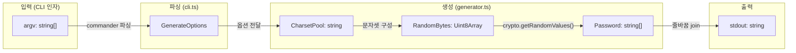
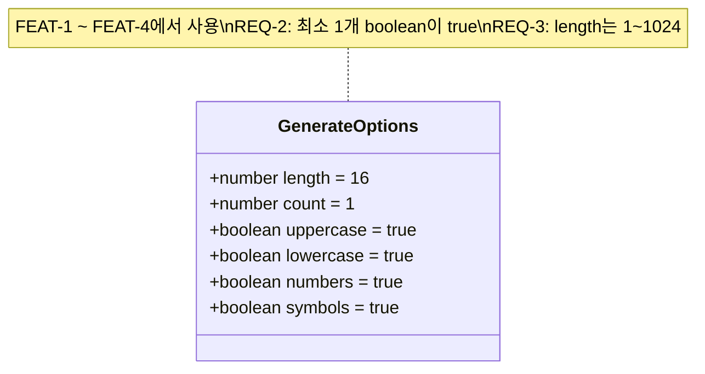
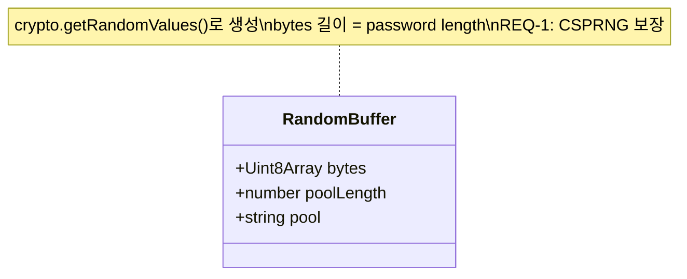
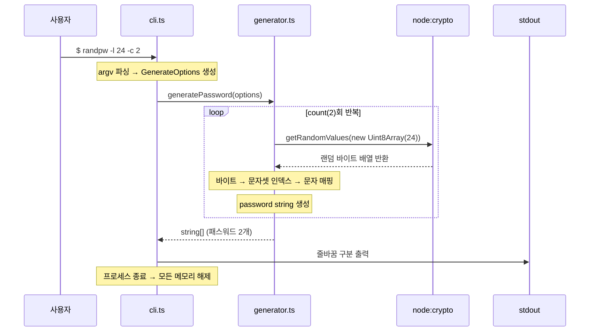

# Database Design: randpw - 데이터 설계

## MVP 캡슐

1. **목표(Outcome)**: 안전한 랜덤 패스워드를 CLI에서 즉시 생성
2. **페르소나/타깃 사용자**: 개발자, 시스템 관리자, CLI 파워 유저
3. **핵심 가치 제안**: `npx randpw` 한 줄로 암호학적으로 안전한 패스워드 즉시 생성
4. **EPIC-1**: 패스워드 생성 기능
5. **FEAT-1**: 옵션별 패스워드 생성 (길이, 문자종류, 개수 지정)
6. **노스스타 지표**: npm 주간 다운로드 수
7. **입력 지표**: (1) GitHub 스타 수, (2) CLI 실행 성공률 (에러율 < 0.1%)
8. **Non-goals**: (1) GUI/웹 인터페이스, (2) 패스워드 저장/관리, (3) 클라우드 동기화
9. **NFR Top 2**: (1) crypto.getRandomValues 기반 보안 랜덤 (NFR-1), (2) 응답 시간 < 50ms (NFR-2)
10. **데이터 민감도**: PII 없음, 상태 저장 없음, 생성된 패스워드는 stdout으로만 출력 후 보관하지 않음
11. **Top 리스크**: Math.random() 사용 시 예측 가능한 패스워드 생성 → 완화: node:crypto 모듈 강제 사용, lint 규칙으로 Math.random 금지
12. **다음 7일 액션**: MVP 구현 → 테스트 → npm publish

---

## 해당 없음 고지

이 프로젝트는 **완전한 stateless CLI 도구**로서, 데이터베이스를 사용하지 않는다 (D-07).

- 영구 저장소 없음
- 파일 시스템 접근 없음
- 네트워크 접근 없음
- 사용자 데이터 수집 없음

따라서 본 문서는 전통적인 ERD 대신 **런타임 데이터 흐름**과 **인메모리 데이터 구조**를 기술한다.

> **근거**: D-07 (stateless 아키텍처, 상태 관리 불필요)

---

## 1. 런타임 데이터 흐름

## 2. 인메모리 데이터 구조

### 2.1 GenerateOptions (입력 데이터)

CLI 인자가 파싱된 후 generator에 전달되는 옵션 객체이다.

| 필드 | 타입 | 기본값 | 검증 규칙 | 관련 FEAT/REQ |
|------|------|--------|-----------|-------------|
| `length` | number | 16 | 1 <= length <= 1024 | FEAT-2, REQ-3 |
| `count` | number | 1 | count >= 1 | FEAT-4 |
| `uppercase` | boolean | true | 최소 1개 true | FEAT-3, REQ-2 |
| `lowercase` | boolean | true | 최소 1개 true | FEAT-3, REQ-2 |
| `numbers` | boolean | true | 최소 1개 true | FEAT-3, REQ-2 |
| `symbols` | boolean | true | 최소 1개 true | FEAT-3, REQ-2 |

### 2.2 문자셋 풀 (Charset Pool)

생성 시 사용되는 문자셋 상수이다.

| 셋 이름 | 문자열 | 길이 | 옵션 |
|---------|--------|------|------|
| UPPERCASE | `ABCDEFGHIJKLMNOPQRSTUVWXYZ` | 26 | `--no-uppercase` |
| LOWERCASE | `abcdefghijklmnopqrstuvwxyz` | 26 | `--no-lowercase` |
| NUMBERS | `0123456789` | 10 | `--no-numbers` |
| SYMBOLS | `!@#$%^&*()_+-=[]{}\|;:,.<>?` | 28 | `--no-symbols` |

> 활성화된 셋들을 연결(concat)하여 단일 문자열 풀을 구성한다.

### 2.3 랜덤 바이트 버퍼

## 3. 데이터 생명주기

### 데이터 보존 시간

| 데이터 | 존재 구간 | 보존 시간 | 보안 고려 |
|--------|----------|-----------|-----------|
| CLI 인자 (argv) | 프로세스 시작 ~ 종료 | 밀리초 단위 | 없음 (옵션만 포함) |
| GenerateOptions | 파싱 후 ~ 생성 완료 | 밀리초 단위 | 없음 |
| RandomBytes (Uint8Array) | 생성 ~ 문자 매핑 완료 | 밀리초 단위 | GC에 의해 자동 해제 |
| Password string | 생성 ~ stdout 출력 | 밀리초 단위 | stdout 출력 후 참조 해제 |

## 4. 민감 데이터 분석

| 항목 | 해당 여부 | 설명 |
|------|----------|------|
| PII (개인정보) | 해당 없음 | 사용자 식별 정보 수집 없음 |
| 생성된 패스워드 | 일시적 | 메모리에만 존재, 저장하지 않음 |
| 파일 시스템 쓰기 | 해당 없음 | 어떤 파일도 생성/수정하지 않음 |
| 네트워크 전송 | 해당 없음 | 외부 통신 없음 |
| 로깅 | 해당 없음 | 내부 로그 기록 없음 |

> **결론**: PII 태그가 필요한 필드가 없다. 생성된 패스워드는 stdout으로 출력된 후 프로세스 종료와 함께 소멸한다.

## 5. 멀티테넌시/샤딩 고려

해당 없음. 단일 사용자 로컬 실행 도구이다.

## 6. 향후 데이터 저장 확장 가능성 (v2+)

현재는 stateless이지만, 향후 다음 기능이 추가될 경우 저장소가 필요할 수 있다.

| 기능 | 저장소 후보 | 데이터 | 시기 |
|------|-----------|--------|------|
| 생성 이력 | JSON 파일 (~/.randpw/history.json) | 생성 시각, 옵션 (패스워드 자체는 저장 금지) | v2 보류 |
| 프리셋 저장 | JSON 파일 (~/.randpw/presets.json) | 이름 + GenerateOptions | v2 보류 |
| 패스워드 관리 | 암호화 SQLite | 암호화된 패스워드, 라벨, 메타 | Non-goal |

> **근거**: D-07 (현재 stateless), D-08 (클립보드 v2), D-06 (강도 표시 v2)

> **참고**: 추가 레퍼런스 문서가 제공되지 않았으므로, 일반 모범사례 기반으로 작성하였습니다.
