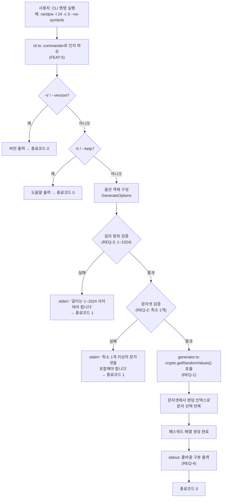
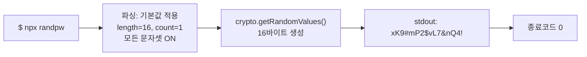
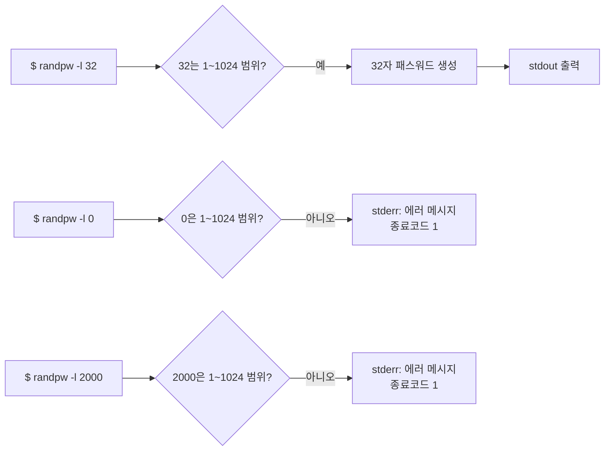
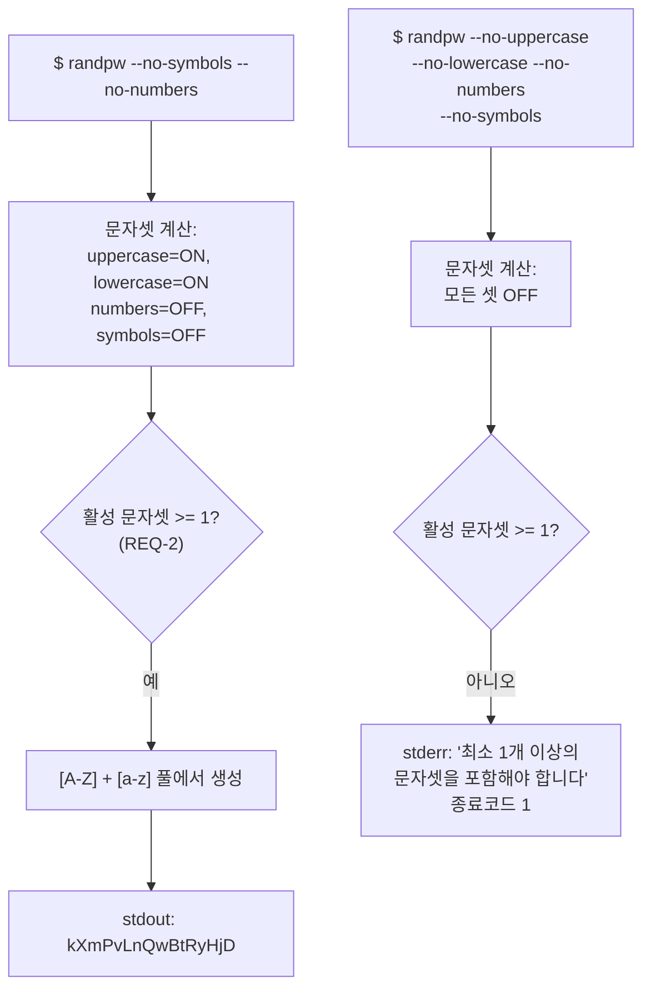
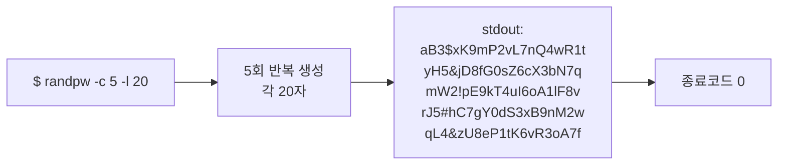
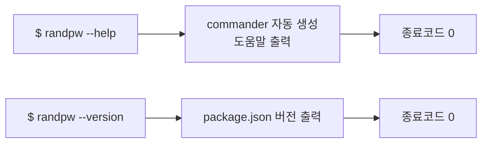
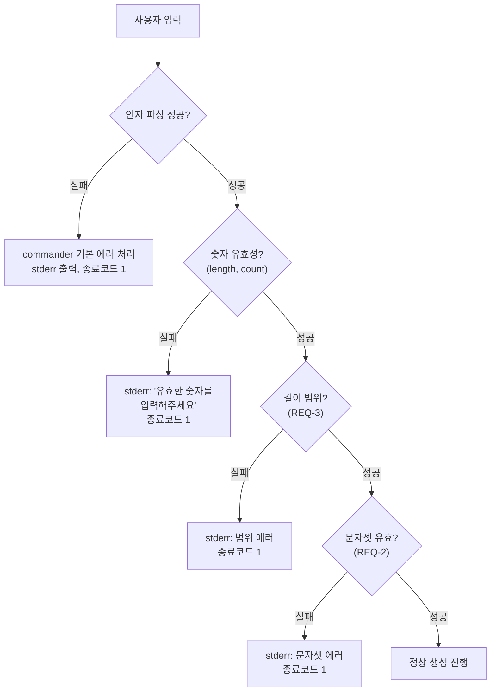
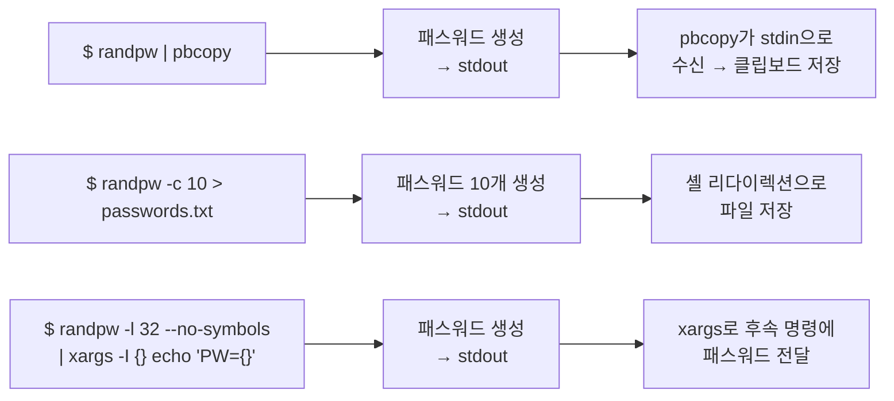

# User Flow: randpw - 사용자 흐름

## MVP 캡슐

1. **목표(Outcome)**: 안전한 랜덤 패스워드를 CLI에서 즉시 생성
2. **페르소나/타깃 사용자**: 개발자, 시스템 관리자, CLI 파워 유저
3. **핵심 가치 제안**: `npx randpw` 한 줄로 암호학적으로 안전한 패스워드 즉시 생성
4. **EPIC-1**: 패스워드 생성 기능
5. **FEAT-1**: 옵션별 패스워드 생성 (길이, 문자종류, 개수 지정)
6. **노스스타 지표**: npm 주간 다운로드 수
7. **입력 지표**: (1) GitHub 스타 수, (2) CLI 실행 성공률 (에러율 < 0.1%)
8. **Non-goals**: (1) GUI/웹 인터페이스, (2) 패스워드 저장/관리, (3) 클라우드 동기화
9. **NFR Top 2**: (1) crypto.getRandomValues 기반 보안 랜덤 (NFR-1), (2) 응답 시간 < 50ms (NFR-2)
10. **데이터 민감도**: PII 없음, 상태 저장 없음, 생성된 패스워드는 stdout으로만 출력 후 보관하지 않음
11. **Top 리스크**: Math.random() 사용 시 예측 가능한 패스워드 생성 → 완화: node:crypto 모듈 강제 사용, lint 규칙으로 Math.random 금지
12. **다음 7일 액션**: MVP 구현 → 테스트 → npm publish

---

## 1. 메인 플로우: 패스워드 생성 (FEAT-1 ~ FEAT-5)

사용자가 CLI 명령을 실행하면 옵션을 파싱하고, 검증을 거쳐 패스워드를 생성하여 출력하는 전체 흐름이다.

## 2. 기본 사용 플로우 (FEAT-1)

옵션 없이 기본값으로 패스워드를 생성하는 가장 일반적인 흐름이다.

## 3. 길이 커스터마이징 플로우 (FEAT-2)

## 4. 문자셋 필터링 플로우 (FEAT-3)

## 5. 다중 생성 플로우 (FEAT-4)

## 6. 도움말/버전 플로우 (FEAT-5)

## 7. 에러 처리 플로우 (RISK-2)

## 8. 파이프 활용 플로우 (UC-4)

stdout만 사용하므로 Unix 파이프와 자연스럽게 연동된다.

## 9. 흐름 요약

| 흐름 | 관련 FEAT/REQ | 입력 예시 | 출력 |
|------|-------------|-----------|------|
| 기본 생성 | FEAT-1, REQ-1, REQ-4 | `randpw` | 16자 패스워드 1개 |
| 길이 지정 | FEAT-2, REQ-3 | `randpw -l 32` | 32자 패스워드 |
| 문자셋 필터 | FEAT-3, REQ-2 | `randpw --no-symbols` | 특수문자 제외 패스워드 |
| 다중 생성 | FEAT-4, REQ-4 | `randpw -c 5` | 패스워드 5개 (줄바꿈 구분) |
| 도움말/버전 | FEAT-5 | `randpw --help` | 사용법 출력 |
| 에러 | REQ-2, REQ-3, RISK-2 | `randpw --no-uppercase --no-lowercase --no-numbers --no-symbols` | 에러 메시지 + 종료코드 1 |
| 파이프 연동 | REQ-4 | `randpw \| pbcopy` | 클립보드 저장 |

> **참고**: 추가 레퍼런스 문서가 제공되지 않았으므로, 일반 모범사례 기반으로 작성하였습니다.
